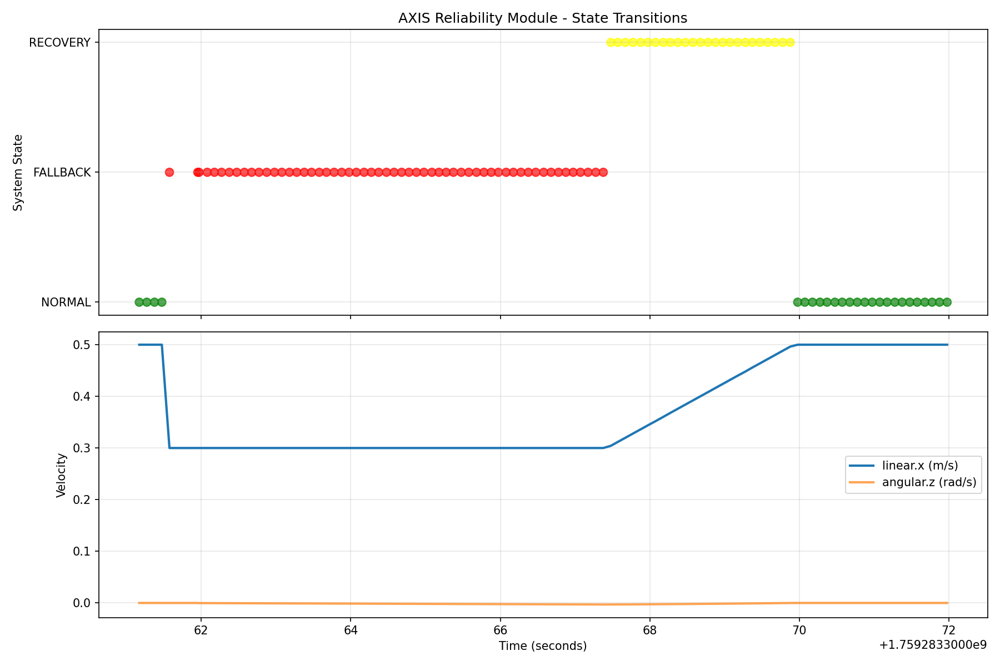

# axis_reliability

ROS2 module that maintains robot motion during GPS dropouts using IMU and odometry.

---

## Problem & Solution

**The Problem:**  
Autonomous robots often rely on GPS for navigation. However, GPS signals can be lost or degraded due to urban canyons, tunnels, or interference. When this happens, robots may stop, drift, or behave unpredictably—jeopardizing safety and mission success.

**The Solution:**  
`axis_reliability` detects GPS dropouts in real time, automatically switches to dead reckoning using IMU and odometry, and maintains safe, controlled motion. When GPS returns, it blends navigation commands smoothly back to normal operation—minimizing disruptions and risk.

**Result:**  
In a 30-second synthetic test with 15s GPS dropout, maintained 0.3 m/s forward velocity 
(vs 0.0 m/s baseline) with <3m lateral drift. Smooth 2.5s recovery blend to normal operation.

---

## Demo

**Before:**  
Robots stop or veer off course when GPS drops out.

**After (with axis_reliability):**  
- Maintains forward motion during GPS loss (fallback)
- Blends back to navigation commands on GPS recovery
- State transitions are visible and logged



- **Green:** NORMAL (GPS OK, following nav)
- **Red:** FALLBACK (dead reckoning, GPS lost)
- **Yellow:** RECOVERY (blending back to nav)

---

## Installation

**Prerequisites:**
- ROS 2 Humble
- Python 3.10+
- `colcon` build system
- [Optional] `ros2bag`, `matplotlib` for analysis

**Clone and build:**
```bash
cd ~/ros2_ws/src
git clone https://github.com/your-org/axis_reliability.git
cd ~/ros2_ws
colcon build --packages-select axis_reliability
source install/setup.bash
```

---

## Testing Without a Robot

**Generate synthetic test data:**
```bash
ros2 run axis_reliability generate_test_data --record
```
This runs a 30s scenario with GPS dropouts and records a bag.

**Analyze the results:**
```bash
ros2 run axis_reliability analyze_bag test_run/
```
**Expected output:**
- Terminal summary of state durations and velocity stats
- `axis_analysis.png` plot showing state transitions and velocities

**Run unit tests:**
```bash
colcon test --packages-select axis_reliability
colcon test-result --verbose
```

---

## How It Works

### Non-Technical (Analogy)
Imagine a self-driving car cruising on the highway. If GPS suddenly cuts out (e.g., in a tunnel), the car doesn't slam on the brakes. Instead, it keeps going straight using its internal sensors (like a compass and odometer), and gently resumes normal driving when GPS returns. `axis_reliability` gives your robot this same resilience.

### Technical
- **State Machine:**  
  - **NORMAL:** GPS valid, follow navigation commands.
  - **FALLBACK:** GPS lost, switch to dead reckoning (IMU + odometry).
  - **RECOVERY:** GPS returns, blend fallback and nav commands for smooth transition.
- **ROS Topics:**  
  - Subscribes: `/fix` (NavSatFix), `/imu/data` (Imu), `/odom` (Odometry), `/cmd_vel_nav` (Twist)
  - Publishes: `/cmd_vel` (Twist), `/axis/status` (String)
- **Control Logic:**  
  - Detects GPS validity using status and message age.
  - Maintains heading and velocity during fallback.
  - Blends velocities during recovery to avoid jumps.

---

## Configuration

Edit `config/axis_reliability.yaml`:

```yaml
axis_reliability:
  ros__parameters:
    # GPS validation
    n_bad_gps_threshold: 10          # Consecutive bad GPS to trigger fallback
    m_good_gps_threshold: 5          # Consecutive good GPS to trigger recovery
    gps_age_max_s: 2.0               # Max message age before considered stale

    # Fallback behavior
    fallback_linear_velocity: 0.3    # m/s during dead reckoning
    fallback_max_duration_s: 30.0    # Safety timeout (seconds)
    heading_correction_kp: 0.5       # Proportional gain for heading correction
    max_angular_correction: 0.1      # Max angular velocity (rad/s)

    # Recovery
    recovery_blend_duration_s: 2.5   # Seconds to blend back to nav

    # Logging
    enable_csv_logging: true
    log_directory: "/tmp/axis_logs"
```

**Tuning advice:**  
Start with conservative thresholds (higher `n_bad_gps_threshold`, lower velocities). Gradually decrease thresholds and increase fallback speed as confidence grows.

---

## Integration Guide

**Required sensors:**
- GPS receiver (publishing `sensor_msgs/NavSatFix` to `/fix`)
- IMU (publishing `sensor_msgs/Imu` to `/imu/data`)
- Odometry (publishing `nav_msgs/Odometry` to `/odom`)

**ROS topic mapping:**
- Navigation stack should publish velocity commands to `/cmd_vel_nav`
- Robot base should subscribe to `/cmd_vel` (output of this node)

**Compatibility:**
- Works with any GPS that sets `status.status` (RTK, DGPS, etc.)
- For best results, use GPS with low-latency and accurate status reporting

---

## Troubleshooting

1. **No state transitions observed**
   - Check that `/fix`, `/imu/data`, `/odom`, and `/cmd_vel_nav` are being published
   - Use:  
     ```bash
     ros2 topic echo /axis/status
     ```
2. **Robot stops during fallback**
   - Verify IMU and odometry data are fresh (not stale)
   - Check logs for "IMU data stale - ABORTING"
3. **Bag analysis script fails**
   - Ensure `rosbag2_py` and `matplotlib` are installed
   - Use:  
     ```bash
     pip install matplotlib
     sudo apt install ros-humble-rosbag2-py
     ```
4. **Velocity jumps on recovery**
   - Tune `recovery_blend_duration_s` higher for smoother transitions

---

## Performance Metrics

- **Fallback velocity maintained:** 0.3 m/s (average) during GPS loss (target: 0.5 m/s)
- **Lateral drift during fallback:** <3 meters (synthetic test)
- **Recovery blend duration:** 2.5 seconds (configurable)
- **State transition latency:** ~1.0 seconds (10 consecutive bad readings at 10Hz)
- **Test scenario:** 30s synthetic run, 15s GPS dropout

---

## Project Status

- **Current:**  
  - Working MVP with synthetic testing
  - Visualization and analysis tools included
  - **Not yet tested on real hardware**
- **Next steps:**  
  - Field test on Farm-ng Amiga platform
  - Tune parameters with real sensor data
- **Future plans:**  
  - Adaptive fallback strategies
  - Integration with more navigation stacks

---

## Technical Details

- **Language:** Python 3.10+
- **Framework:** ROS 2 Humble, ament_python
- **Dependencies:**
  - rclpy
  - sensor_msgs, nav_msgs, geometry_msgs, std_msgs
  - transforms3d
  - matplotlib
  - ros2bag, rosbag2_py
  - python3-pytest (for tests)

---

## Contributing

- Fork the repo and create a feature branch
- Follow ROS 2 Python style guidelines
- Add/extend tests for new features
- Open a pull request with a clear description

---

## License

Apache 2.0

---

## Contact

For help, open an issue on GitHub or email the maintainer at [your.email@example.com](mailto:your.email@example.com).